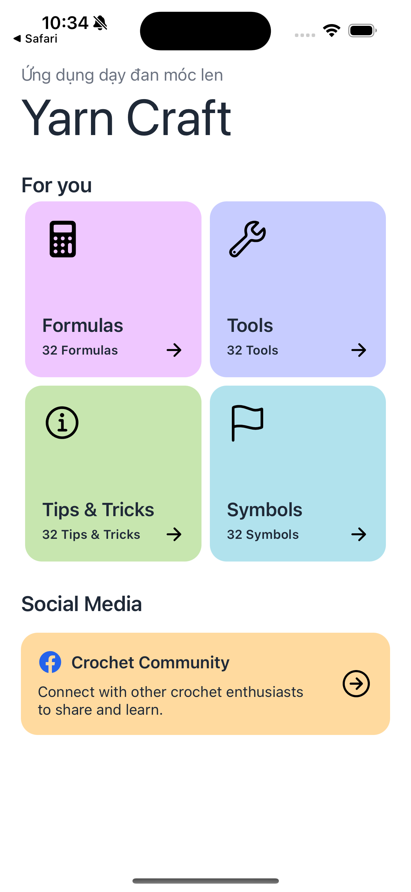
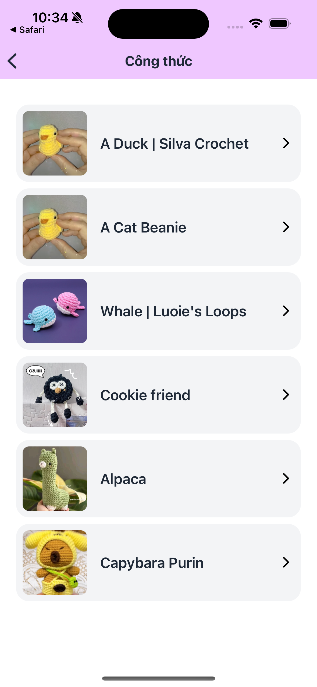
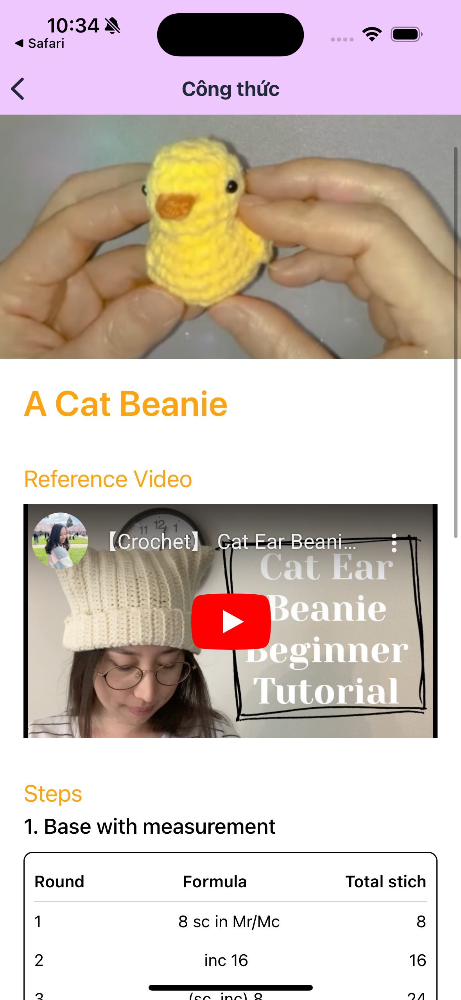
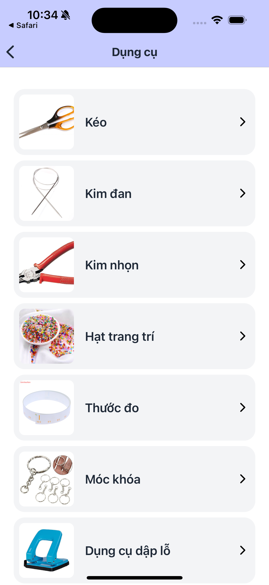

# YarnCraft

YarnCraft is a treasure trove for crochet and knitting enthusiasts, offering a diverse collection of ideas and patterns to inspire creativity. With step-by-step guides, helpful tips, and a vibrant community, YarnCraft makes it easy for users to bring their creative and unique works to life.

## Key Features

- **Rich Crochet and Knitting Pattern Library**:  
  Explore an extensive collection of patterns, organized by difficulty level, to suit both beginners and experienced crafters.

- **Detailed Step-by-Step Instructions**:  
  Follow clear, easy-to-understand instructions for each pattern, ensuring successful and enjoyable crafting experiences.

- **List of Required Tools**:  
  Each pattern comes with a list of all necessary tools and materials, making it simple to gather everything you need before starting your project.

- **Tips and Tricks**:  
  Access expert advice and helpful tips to improve your crochet and knitting skills, whether you're just starting or looking to refine your techniques.

- **Crochet and Knitting Symbol Chart**:  
  Use standardized symbol charts to understand and interpret crochet and knitting patterns with ease.

- **Crochet and Knitting Community**:  
  Join a community of like-minded creators to share your works, ask questions, and learn from others’ experiences.

## Technology Stack

- **React Native**:  
  Powers the app’s cross-platform development, ensuring smooth and consistent performance on both iOS and Android devices.

- **Redux Toolkit**:  
  Efficiently manages the global state of the app, ensuring that pattern selections, user preferences, and community interactions are seamlessly updated.

- **Native Wind**:  
  Enables fast and flexible styling of the app’s interface, ensuring a visually appealing and user-friendly experience.

- **Async Storage**:  
  Stores user data locally, such as favorite patterns and tool lists, allowing for offline access and a more personalized user experience.


## Screenshots

Here are some screenshots of YarnCraft in action:
<div>
  
  
  
  
</div>


## Download Demo

You can download the demo version of YarnCraft here:

- [Download for Android](link_to_android_demo)


## Getting Started

### Prerequisites

To run the project, you need to have the following installed:

- Node.js
- npm or yarn
- React Native CLI
- Xcode (for iOS development)
- Android Studio (for Android development)

### Installation

1. Clone the repository:

    ```bash
    git clone https://github.com/your-username/YarnCraft.git
    cd YarnCraft
    ```

2. Install dependencies:

    ```bash
    npm install
    ```

3. Run the app:
    ```bash
    npm start
    ```


